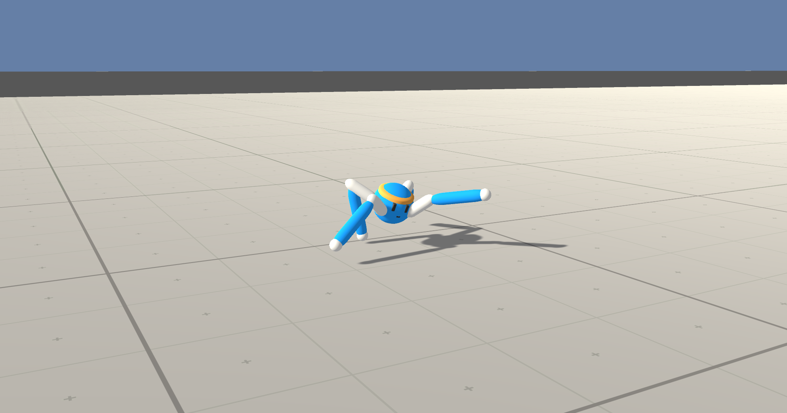

#### Udacity Deep Reinforcement Learning Nanodegree
##### &nbsp;
## Project 2: Continuous Control
### Train an agent to move to (and maintain its position at) the target location for as many time steps as possible


***Source: 2. The Environment - Introduction***

##### &nbsp;

## ==Project Details==

## Goal
In this [Reacher](https://github.com/Unity-Technologies/ml-agents/blob/master/docs/Learning-Environment-Examples.md#reacher) environment, a double-jointed arm can move to target locations. The **goal** of the agent is to maintain its position at the target location for as many time steps as possible..

As discovered in ***1. Start the Environment***, the **Vector Action space size** (per agent) is 4 and the **Vector Observation space size** (per agent) is 33. In this ***Version 2***, the **number of agents** is 20.

A reward of +0.1 is provided for each step that the agent's hand is in the goal location. 

The task is *continuous*, and **in order to solve the environment**, the agents must get ***an average score of +30 (over 100 consecutive episodes, and over all agents)***. 

##### &nbsp;

## ==Getting Started (with this repo)==
Load the Jupyter notebook  **`Continuous_Control_20_Final.ipynb`**. 
Take note of *which* **UnityEnvironment** file_name to use, depending on whether you're running in the Udacity workspace or in an Ubuntu 18.04.2 LTS Unity environment. (If you are running on Mac OSX or Windows, there will be a different UnityEnvironment as well.)

In addition, for this project we are provided ***two*** separate versions of the Unity **Reacher** environment:

-     The first version contains ***a single agent***.
-     The second version contains ***20 identical agents***, each with its own copy of the environment.

**`Continuous_Control_20_Final.ipynb`** uses the ***2nd version***.

##### &nbsp;

## ==Instructions (for running locally in Ubuntu 18.04.2 LTS)==

There is a  **`requirements.txt`** file that you can use to replicate my environment. (Make sure you also have the proper NVIDIA drivers installed if using GPU, and the correct Unity ML environment.)

##### &nbsp;

## Solution Approach
Basic steps to build an agent that solves this environment:
(These four map to the 4 steps in the file **`Continuous_Control_20_Final.ipynb`**.)

1. Start the Environment
2. Examine the State and Action Spaces
3. Take Random Actions in the Environment
4. Train agent to solve the environment!


### 1. Start the Environment
Import the required libraries and create the UnityEnvironment . Note the **Vector Observation space size (per agent) = 33** and **Vector Action space size (per agent) = 4**.


### 2. Examine the State and Action Spaces
The state space has 33 dimensions which include position, rotation, velocity, and angular velocities of the two arm Rigidbodies. The action space consists of 4 (continuous), corresponding to torque applicable to two joints.


### 3. Take Random Actions in the Environment
The following code - taken from ***3. Take Random Actions in the Environment*** of the **Continuous Control** project - accomplishes this initial sanity check.

```python
env_info = env.reset(train_mode=False)[brain_name]     # reset the environment    
states = env_info.vector_observations                  # get the current state (for each agent)
scores = np.zeros(num_agents)                          # initialize the score (for each agent)
while True:
    actions = np.random.randn(num_agents, action_size) # select an action (for each agent)
    actions = np.clip(actions, -1, 1)                  # all actions between -1 and 1
    env_info = env.step(actions)[brain_name]           # send all actions to tne environment
    next_states = env_info.vector_observations         # get next state (for each agent)
    rewards = env_info.rewards                         # get reward (for each agent)
    dones = env_info.local_done                        # see if episode finished
    scores += env_info.rewards                         # update the score (for each agent)
    states = next_states                               # roll over states to next time step
    if np.any(dones):                                  # exit loop if episode finished
        break

print('Total score (averaged over agents) this episode: {}'.format(np.mean(scores)))
```

Running the agent three (3) times produced the following scores: 0.091, 0.118, and 0.196. This step is just to ensure that the environment works and that we are ready to try our solution.

##### &nbsp;

## ==Learning Algorithm==
The algorithm used is **Deep Deterministic Policy Gradients (DDPG)**.

The final hyper-parameters used were as follows (n_episodes=1000, max_t=1000).

```python
BUFFER_SIZE = int(1e6)  # replay buffer size
BATCH_SIZE = 128        # minibatch size
GAMMA = 0.99            # discount factor
TAU = 1e-3              # for soft update of target parameters
LR_ACTOR = 1e-3         # learning rate of the actor
LR_CRITIC = 1e-3        # learning rate of the critic
WEIGHT_DECAY = 0        # L2 weight decay
LEARN_EVERY = 20        # learning timestep interval
LEARN_NUM = 10          # number of learning passes
OU_SIGMA = 0.2          # Ornstein-Uhlenbeck noise parameter
OU_THETA = 0.15         # Ornstein-Uhlenbeck noise parameter
EPSILON = 1.0           # explore->exploit noise process added to act step
EPSILON_DECAY = 1e-6    # decay rate for noise process
```


### 4. Train agent to solve the environment!

Here is a detailed network diagram of DDPG. [Source](https://medium.com/@markus.x.buchholz/deep-reinforcement-learning-deep-deterministic-policy-gradient-ddpg-algoritm-5a823da91b43) 


##### &nbsp;

The following sections describe important concepts related to the **DDPG** algorithm.

#### Policy-Based vs. Value-Vased Methods
There are two key differences between this project's [Reacher](https://github.com/Unity-Technologies/ml-agents/blob/master/docs/Learning-Environment-Examples.md#reacher) environment and the previous project's [Banana Collector](https://github.com/Unity-Technologies/ml-agents/blob/master/docs/Learning-Environment-Examples.md#banana-collector)  environment.:
1. **Multple agents** &mdash; The **Version 2** of the environment I selected has 20 agents, while the Navigation project had a single agent. 
2. **Continuous action space** &mdash; The action space is now _continuous_, which allows each agent to execute more complex and precise movements. Essentially, there's an unlimited range of possible action values to control the robotic arm, whereas the agent in the Navigation project was limited to four _discrete_ actions: forward, backward, left, right.

Given the complexity of this environment, the **value-based method** we used in the last project - the **Deep Q-Network (DQN)** algorithm - is not suitable. We need an algorithm that allows the robotic arm to utilize its full range of movement. We'll need to explore a different class of algorithms called **policy-based methods**.

Some advantages of policy-based methods:
- **Continuous action spaces** &mdash; Policy-based methods are well-suited for continuous action spaces.
- **Stochastic policies** &mdash; Both value-based and policy-based methods can learn deterministic policies. However, policy-based methods can also learn true stochastic policies.
- **Simplicity** &mdash; Policy-based methods directly learn the optimal policy, without having to maintain a separate value function estimate. With value-based methods, the agent uses its experience with the environment to maintain an estimate of the optimal action-value function, from which an optimal policy is derived. This intermediate step requires the storage of lots of additional data since you need to account for all possible action values. Even if you discretize the action space, the number of possible actions can be quite high. For example, if we assumed only 10 degrees of freedom for both joints of our robotic arm, we'd have 1024 unique actions (2<sup>10</sup>). Using DQN to determine the action that maximizes the action-value function within a continuous or high-dimensional space requires a complex optimization process at every timestep.

#### Deep Deterministic Policy Gradient (DDPG)
This algorithm is outlined in [this paper](https://arxiv.org/pdf/1509.02971.pdf), _Continuous Control with Deep Reinforcement Learning_, by researchers at Google Deepmind. In this paper, the authors present "a model-free, off-policy actor-critic algorithm using deep function approximators that can learn policies in high-dimensional, continuous action spaces." They highlight that DDPG can be viewed as an extension of Deep Q-learning for continuous tasks.

#### Actor-Critic Method
Actor-critic methods leverage the strengths of both policy-based and value-based methods.

Using a policy-based approach, the agent (actor) learns how to act by directly estimating the optimal policy and maximizing reward through gradient ascent. Meanwhile, employing a value-based approach, the agent (critic) learns how to estimate the value (i.e., the future cumulative reward) of different state-action pairs. Actor-critic methods combine these two approaches in order to accelerate the learning process. Actor-critic agents are also more stable than value-based agents, while requiring fewer training samples than policy-based agents.

You can find the actor-critic logic implemented in the file **`ddpg_agent.py`**. The actor-critic models can be found via their respective **`Actor()`** and **`Critic()`** classes in **`models.py`**.

In the algorithm, local and target networks are implemented separately for both the actor and the critic.

```python
        # Actor Network (w/ Target Network)
        self.actor_local = Actor(state_size, action_size, random_seed).to(device)
        self.actor_target = Actor(state_size, action_size, random_seed).to(device)
        self.actor_optimizer = optim.Adam(self.actor_local.parameters(), lr=LR_ACTOR)

        # Critic Network (w/ Target Network)
        self.critic_local = Critic(state_size, action_size, random_seed).to(device)
        self.critic_target = Critic(state_size, action_size, random_seed).to(device)
        self.critic_optimizer = optim.Adam(self.critic_local.parameters(), lr=LR_CRITIC, weight_decay=WEIGHT_DECAY)
```

#### Exploration vs Exploitation
One challenge is choosing which action to take while the agent is still learning the optimal policy. Should the agent choose an action based on the rewards observed thus far? Or, should the agent try a new action in hopes of earning a higher reward? This is known as the **exploration-exploitation dilemma**.

In the Navigation project, this is addressed by implementing an **𝛆-greedy algorithm**. This algorithm allows the agent to systematically manage the exploration vs. exploitation trade-off. The agent "explores" by picking a random action with some probability epsilon `𝛜`. Meanwhile, the agent continues to "exploit" its knowledge of the environment by choosing actions based on the deterministic policy with probability (1-𝛜).

However, this approach won't work for controlling a robotic arm. The reason is that the actions are no longer a discrete set of simple directions (i.e., forward, backward, left, right). The actions driving the movement of the arm are forces with different magnitudes and directions. If we base our exploration mechanism on random uniform sampling, the direction actions would have a mean of zero, in turn cancelling each other out. This can cause the system to oscillate without making much progress.

Instead, we'll use the **Ornstein-Uhlenbeck process**, as suggested in the previously mentioned [paper by Google DeepMind](https://arxiv.org/pdf/1509.02971.pdf) (see bottom of page 4). The Ornstein-Uhlenbeck process adds a certain amount of noise to the action values at each timestep. This noise is correlated to previous noise, and therefore tends to stay in the same direction for longer durations without canceling itself out. This allows the arm to maintain velocity and explore the action space with more continuity.

You can find the Ornstein-Uhlenbeck process implemented in the **`OUNoise`** class in **`ddpg_agent.py`**.

In total, there are five hyperparameters related to this noise process.

The Ornstein-Uhlenbeck process itself has three hyperparameters that determine the noise characteristics and magnitude:
- mu: the long-running mean
- theta: the speed of mean reversion
- sigma: the volatility parameter

The final noise parameters were set as follows:

```python
OU_SIGMA = 0.2          # Ornstein-Uhlenbeck noise parameter
OU_THETA = 0.15         # Ornstein-Uhlenbeck noise parameter
EPSILON = 1.0           # explore->exploit noise process added to act step
EPSILON_DECAY = 1e-6    # decay rate for noise process
```

#### Experience Replay
Experience replay allows the RL agent to learn from past experience.

DDPG also utilizes a replay buffer to gather experiences from each agent. Each experience is stored in a replay buffer as the agent interacts with the environment. In this project, there is one central replay buffer utilized by all 20 agents, therefore allowing agents to learn from each others' experiences.

The replay buffer contains a collection of experience tuples with the state, action, reward, and next state `(s, a, r, s')`. Each agent samples from this buffer as part of the learning step. Experiences are sampled randomly, so that the data is uncorrelated. This prevents action values from oscillating or diverging catastrophically, since a naive algorithm could otherwise become biased by correlations between sequential experience tuples.

Also, experience replay improves learning through repetition. By doing multiple passes over the data, our agents have multiple opportunities to learn from a single experience tuple. This is particularly useful for state-action pairs that occur infrequently within the environment.

#### Neural Network
As implemented in the file **`model.py`**, both **Actor** and **Critic** (and local & target for each) consist of three (3) fully-connected (**Linear**) layers. The **input to fc1 is state_size**, while the **output of fc3 is action_size**. There are **400 and 300 hidden units** in fc1 and fc2, respectively, and **batch normalization (BatchNorm1d) **is applied to fc1. **ReLU activation is applied to fc1 and fc2**, while **tanh is applied to fc3**.

##### &nbsp;

**NOTE**: The files **`ddpg_agent.py`** and **`model.py`** were taken *almost verbatim* from the **Deep Deterministic Policy Gradients (DDPG)** Coding Exercise in **3. Policy-Based Methods, Lesson 5. Actor-Critic Methods.** Specificially, from **DDPG.ipynb** running the **'Pendulum-v0'** gym environment.

##### &nbsp;

## ==Plot of Rewards==

The best result (DDPG) from Step 4 was an agent able to solve the environment ***in 5 episodes!***.


##### &nbsp;

## ==Ideas for Future Work==
1. Do **hyper-parameter tuning** on the current DDPG model.
2. Try **Trust Region Policy Optimization (TRPO)** and **Truncated Natural Policy Gradient (TNPG)** as these two algorithms have been shown to achieve better performance.
3. Try the (very!) recent **Distributed Distributional Deterministic Policy Gradients (D4PG)** algorithm as another method for adapting DDPG for continuous control. 
4. Try the **(Optional) Challenge: Crawl**. This is **==DONE!==**


###### &nbsp;
Here's my initial try:


##### &nbsp;

---

# Project Starter Code
###### &nbsp;
The project starter code can be found below, in case you want to run this project yourself.

Also, the original Udacity repository for this project can be found [here](https://github.com/udacity/deep-reinforcement-learning/tree/master/p2_continuous-control).


## ==Getting Started==

1. Download the Unity environment.  For this project, you will **not** need to install Unity - this is because Udacity has already built the environment for you, and you can download it from one of the links below. You need only select the environment that matches your operating system:

**Version 1: One (1) Agent**
    - Linux: [click here](https://classroom.udacity.com/nanodegrees/nd893-ent/parts/3f657114-51e6-476e-a34d-0513f8173072/modules/7a7f8ae1-8786-4195-ad38-af58bf50cd02/lessons/665ccd87-d19f-4108-bf56-ee1d3054c2a8/concepts/2303cf3b-d5dc-42b0-8d15-e379fa76c6d5)
    - Mac OSX: [click here](https://classroom.udacity.com/nanodegrees/nd893-ent/parts/3f657114-51e6-476e-a34d-0513f8173072/modules/7a7f8ae1-8786-4195-ad38-af58bf50cd02/lessons/665ccd87-d19f-4108-bf56-ee1d3054c2a8/concepts/2303cf3b-d5dc-42b0-8d15-e379fa76c6d5)
    - Windows (32-bit): [click here](https://classroom.udacity.com/nanodegrees/nd893-ent/parts/3f657114-51e6-476e-a34d-0513f8173072/modules/7a7f8ae1-8786-4195-ad38-af58bf50cd02/lessons/665ccd87-d19f-4108-bf56-ee1d3054c2a8/concepts/2303cf3b-d5dc-42b0-8d15-e379fa76c6d5)
    - Windows (64-bit): [click here](https://classroom.udacity.com/nanodegrees/nd893-ent/parts/3f657114-51e6-476e-a34d-0513f8173072/modules/7a7f8ae1-8786-4195-ad38-af58bf50cd02/lessons/665ccd87-d19f-4108-bf56-ee1d3054c2a8/concepts/2303cf3b-d5dc-42b0-8d15-e379fa76c6d5)

**Version 2: Twenty (20) Agents**
    - Linux: [click here](https://classroom.udacity.com/nanodegrees/nd893-ent/parts/3f657114-51e6-476e-a34d-0513f8173072/modules/7a7f8ae1-8786-4195-ad38-af58bf50cd02/lessons/665ccd87-d19f-4108-bf56-ee1d3054c2a8/concepts/2303cf3b-d5dc-42b0-8d15-e379fa76c6d5)
    - Mac OSX: [click here](https://classroom.udacity.com/nanodegrees/nd893-ent/parts/3f657114-51e6-476e-a34d-0513f8173072/modules/7a7f8ae1-8786-4195-ad38-af58bf50cd02/lessons/665ccd87-d19f-4108-bf56-ee1d3054c2a8/concepts/2303cf3b-d5dc-42b0-8d15-e379fa76c6d5)
    - Windows (32-bit): [click here](https://classroom.udacity.com/nanodegrees/nd893-ent/parts/3f657114-51e6-476e-a34d-0513f8173072/modules/7a7f8ae1-8786-4195-ad38-af58bf50cd02/lessons/665ccd87-d19f-4108-bf56-ee1d3054c2a8/concepts/2303cf3b-d5dc-42b0-8d15-e379fa76c6d5)
    - Windows (64-bit): [click here](https://classroom.udacity.com/nanodegrees/nd893-ent/parts/3f657114-51e6-476e-a34d-0513f8173072/modules/7a7f8ae1-8786-4195-ad38-af58bf50cd02/lessons/665ccd87-d19f-4108-bf56-ee1d3054c2a8/concepts/2303cf3b-d5dc-42b0-8d15-e379fa76c6d5)

2. Place the file in the DRLND GitHub repository, in the `p2_continuous-control/` folder, and unzip (or decompress) the file.

## ==Instructions==

Follow the instructions in `Continuous_Control.ipynb` to get started with training your own agent!  
